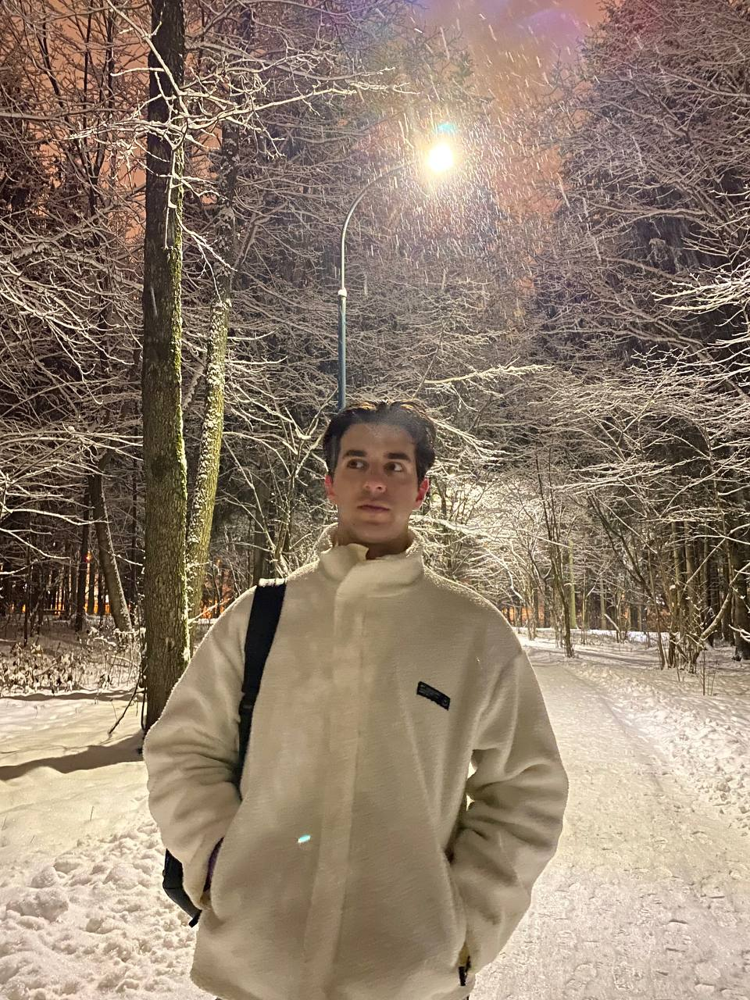

</img>

## Rybak Alexander
**Email:** alexander.rybak2021@gmail.com  
**Phone:** +375295748918  
**Born:** 19 December 2000 Age: 21  
**GitHub:** https://github.com/Alexander-1519
 

***
## CAREER OBJECTIVES:

I'm an enthusiastic and detail-oriented Java Software Engineer seeking an entry-level Full Stack position with Company to use my skills in coding, troubleshooting complex problems, and assisting in the timely completion of projects.  

***
## WORK EXPERIENCE:

#### Java Developer | EffectiveSoft
###### Dec 2021 - Present | Minsk
Provided expect support in developing and implementing effective technical solutions that enhances the system's performance and subsequently boosted business efficiency.

***
## EDUCATION:

- **specialization:** Information systems and technologies  
**university:** International Sakharov Environmental Institute of Belarusian State University  
**dates:** Sep 2018 - June 2022  

- **position:** Java Developer Intern  
**company:** LeverX  
**dates:** Dec 2020 - Jan 2021  

- **position:** Java Developer Intern  
**company:** iTeachArt  
**dates:** May 2021 - Jul 2021 

***
## SKILLS:

**Languages:** Java, C/C++, SQL  
**Databases:** MySql, PostgreSql, MongoDB, Redis, Microsoft SQL Server  
**Frameworks:** J2EE, Spring (Core, ORM, Security, Test, MVC), Spring Boot, Hibernate, AWS S3, Kafka

***
## LANGUAGES:

**Belarusian:** native  
**Russian:** native  
**English:** B1